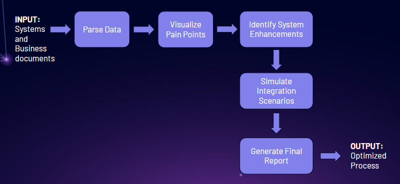

# myAIidea
Building my AI idea with with the help of a great community.

NX8020™: AI process mining and systems integration platform.

Use Machine Learning to identify optimal processes. Leverage Large Language Models to implement systems integrations that are simpler, faster, and cheaper.

For Small and Medium size Businesses, looking to simplify their operations while increasing profits.

Input: Systems and Business documents

Output: Optimized Process